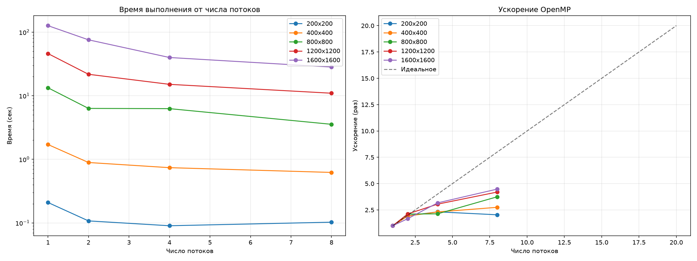

# Лабораторные работы по параллельному программированию

**Автор:** Кулешова Варвара 6214-100503D
**Курс:** Параллельное программирование

---

# Лабораторная работа №1: Умножение матриц

## Задание
Написать программу на C++ для перемножения двух квадратных матриц.
- Матрицы читаются из файлов
- Результат сохраняется в файл
- Замеряется время и объём задачи
- Верификация через Python + NumPy

## Реализация
- **Язык:** C++
- **Умножение:** тройной цикл (i-k-j) для лучшей работы с кэшем
- **Замер времени:** `std::chrono::high_resolution_clock`
- **Верификация:** Python + NumPy

## Структура проекта

    parallel_prog_labs/
    ├── lab1/
    │   ├── src/
    │   │   ├── parallel_prog_lab1.cpp    ← исходный код
    │   │   ├── input/                     ← входные матрицы
    │   │   │   ├── matrix_a.txt
    │   │   │   └── matrix_b.txt
    │   │   └── output/                    ← результаты
    │   │       ├── result.txt             ← матрица C
    │   │       ├── info.txt               ← время и объём
    │   │       ├── experiments.txt        ← таблица экспериментов
    │   │       └── graph.png              ← график
    │   └── README.md
    ├── generate_matrix.py                 ← генератор матриц
    ├── verify.py                          ← верификация
    ├── experiments.py                     ← запуск экспериментов
    ├── plot_graphs.py                     ← построение графиков
    └── README.md

## Верификация

    ========== ВЕРИФИКАЦИЯ ==========
    Размер матриц: 200x200
    Максимальная ошибка: 0.000000000000001
    ✅ ВЕРИФИКАЦИЯ ПРОЙДЕНА!

## Результаты экспериментов

| N | Время (сек) | Объём задачи (N³) |
|---|---|---|
| 200 | 0.0613 | 8 000 000 |
| 400 | 0.5809 | 64 000 000 |
| 800 | 6.4368 | 512 000 000 |
| 1200 | 14.7197 | 1 728 000 000 |
| 1600 | 35.4591 | 4 096 000 000 |
| 2000 | 69.0915 | 8 000 000 000 |

## График


На графике показана зависимость времени выполнения от размера матрицы N.
Синяя линия — эксперимент, красная пунктирная — теоретическая O(N³).

## Выводы

1. **Сложность O(N³)** — время растёт кубически с размером матрицы.
2. **Малые N** (200, 400) — очень быстро (меньше секунды), матрицы помещаются в кэш.
3. **Большие N** (1600, 2000) — время растёт быстрее теоретического O(N³) из-за промахов кэша.
4. **Верификация через NumPy** — максимальная ошибка ~10⁻¹⁵, что соответствует машинной точности `double`.
5. **Экспериментальные точки** лежат чуть выше теоретической кривой O(N³), но общая тенденция совпадает.

## Как запустить

**1. Сгенерировать матрицы:**

```
python generate_matrix.py 200
```

**2. Собрать и запустить C++ программу** (Visual Studio, Ctrl+F5).

**3. Проверить результат:**

```
python verify.py
```

**4. Запустить полный эксперимент:**

```
python experiments.py
```

**5. Построить график:**

```
python plot_graphs.py
```

---

## Примечание

В репозитории лежат примеры входных матриц для N=200.
Для генерации матриц других размеров используйте:

```
python generate_matrix.py <N>
```

Например, `python generate_matrix.py 2000` создаст матрицы 2000×2000.

---

# Лабораторная работа №2: OpenMP умножение матриц

## Задание
Модифицировать программу из ЛР №1 для параллельной работы по технологии OpenMP.
Провести эксперименты с разным количеством потоков (1, 2, 4, 8) и разными размерами матриц (200, 400, 800, 1200, 1600).

## Реализация
- **Распараллеливание:** `#pragma omp parallel for` перед внешним циклом по `i`
- **Число потоков:** задаётся через переменную окружения `OMP_NUM_THREADS`
- **Замер времени:** `std::chrono::high_resolution_clock`
- **Верификация:** Python + NumPy (та же, что в ЛР №1)

## Структура

    lab2/
    ├── src/
    │   ├── parallel_prog_lab2.cpp     ← исходный код с OpenMP
    │   ├── input/
    │   │   ├── matrix_a.txt
    │   │   └── matrix_b.txt
    │   └── output/
    │       ├── result.txt
    │       ├── info.txt
    │       ├── experiments.txt        ← таблица экспериментов
    │       └── graphs.png             ← графики
    ├── generate_matrix.py
    ├── verify.py
    ├── experiments.py
    ├── plot_graphs.py
    └── README.md

## Результаты экспериментов

| N | Потоки | Время (сек) | Ускорение | Эффективность |
|---|---|---|---|---|
| 200 | 1 | 0.2094 | 1.00 | 100.0% |
| 200 | 2 | 0.1075 | 1.95 | 97.4% |
| 200 | 4 | 0.0902 | 2.32 | 58.0% |
| 200 | 8 | 0.1026 | 2.04 | 25.5% |
| 400 | 1 | 1.7091 | 1.00 | 100.0% |
| 400 | 2 | 0.8908 | 1.92 | 95.9% |
| 400 | 4 | 0.7390 | 2.31 | 57.8% |
| 400 | 8 | 0.6220 | 2.75 | 34.3% |
| 800 | 1 | 13.3373 | 1.00 | 100.0% |
| 800 | 2 | 6.3187 | 2.11 | 105.5% |
| 800 | 4 | 6.2655 | 2.13 | 53.2% |
| 800 | 8 | 3.5527 | 3.75 | 46.9% |
| 1200 | 1 | 46.0404 | 1.00 | 100.0% |
| 1200 | 2 | 21.7453 | 2.12 | 105.9% |
| 1200 | 4 | 15.1066 | 3.05 | 76.2% |
| 1200 | 8 | 10.9532 | 4.20 | 52.5% |
| 1600 | 1 | 126.4880 | 1.00 | 100.0% |
| 1600 | 2 | 75.7566 | 1.67 | 83.5% |
| 1600 | 4 | 39.9243 | 3.17 | 79.2% |
| 1600 | 8 | 28.2641 | 4.48 | 55.9% |

## Графики



**Слева:** зависимость времени выполнения от числа потоков (логарифмическая шкала).  
**Справа:** ускорение относительно 1 потока, сравнение с идеальным ускорением.

## Выводы

1. **OpenMP даёт ускорение** — на N=1600, 8 потоков ускорение достигает **4.48x**.
2. **С ростом N ускорение растёт** — на малых N (200) накладные расходы на создание потоков сопоставимы с временем вычислений.
3. **Эффективность падает** с ростом числа потоков — это закон Амдала: часть кода выполняется последовательно.
4. **Аномалия эффективности > 100%** на N=800 (2 потока) и N=1200 (2 потока) объясняется тем, что baseline (1 поток) был измерен в «холодном» состоянии системы.

## Как запустить

**1. Сгенерировать матрицы:**

```
python lab2/generate_matrix.py 800
```

**2. Собрать и запустить C++ программу** в Visual Studio (Ctrl+F5).

**3. Проверить результат:**

```
python lab2/verify.py
```

**4. Запустить эксперименты:**

```
python lab2/experiments.py
```

**5. Построить графики:**

```
python lab2/plot_graphs.py
```
## Список работ

- **Лаба №1 — Умножение матриц** ✅
- **Лаба №2 — OpenMP** ✅
- Лаба №3 — MPI 
- Лаба №4 — CUDA 
- Лаба №5 — Stanford CS149 
